The North Pole Workshop’s logistics department has been busy this year
with upgrading the sleigh’s dash-cam with a new more powerful computer.
They’ve asked the research and development department if there is
anything that can be done with the extra cycles to make the journey
safer. After bouncing around a couple ideas, they came up with a plan
for an autoland system…but since Santa and the reindeer do not operate
in typical environments (such as roofs), this would not be a typical
autoland system (which use microwave/radio guidance) so they couldn’t
select anything off-the-shelf (and they do know their shelves).

------------------------------------------------------------------------

To help iterate over the requirements for this new system, the elves
knew that PDL could help them process images and try different
approaches quickly. This iterative process will start with simpler
scenarios in order to ensure the algorithms are on the right track.
We’ll start with an airport runway as a test image.

# Setup

First we need to setup the environment to do everything we need: read
images, processing them with some filters, and then plot the results.
Since image processing requires frequent visualisation, this work is
being done in Jupyter Notebook via
[`Devel::IPerl`](https://p3rl.org/Devel::IPerl), but the setup below
allows for display of plots both in a notebook, but also as a regular
Perl script. You can [download the notebook
here](20241222-hough-lines.ipynb).

    use v5.36;
    use utf8;
    use feature qw(signatures postderef);

    use constant IN_IPERL => !! $ENV{PERL_IPERL_RUNNING};
    no if   IN_IPERL, warnings => 'redefine'; # fewer messages when re-running cells
    no if ! IN_IPERL, warnings => 'void';     # fewer messages for variable at end of cell outside of IPerl

    use PDL 2.095;
    use PDL::Constants qw(PI);
    use PDL::IO::Pic;
    use PDL::Image2D;
    use PDL::ImageRGB;

    use SVG;
    use MooX::Struct ();
    use Path::Tiny qw(path);
    use List::Util ();
    use Encode qw(encode_utf8);

    use Data::Printer;
    use Data::Printer::Filter::PDL ();

    use PDL::Graphics::Gnuplot qw(gpwin);

    # Make PDL::Graphics::Gnuplot compatible with IPerl
    use if IN_IPERL, 'Devel::IPerl::Plugin::PDLGraphicsGnuplot';
    if( IN_IPERL ) {
        IPerl->load_plugin('PDLGraphicsGnuplot');
    }

    sub PDL::Graphics::Gnuplot::fancy_display {
        if(IN_IPERL){
            IPerl->display($_[0]);
        } else {
            #sleep 1; $_[0]->close;
            $_[0]->pause_until_close;
        }
    }

    my $gp = gpwin();

# Image processing for feature extraction

The elves know that runways are characterized by strong straight lines:
the edges of the runway, centerline markings, and threshold stripes. If
they can reliably detect these lines in images from the sleigh’s camera,
they’ll have a key piece of their autoland system.

But how do you find straight lines in an image? Let’s break this down
into steps:

1.  First, we need to find places in the image where there are sharp
    changes in brightness — these are edges that might be part of the
    lines we’re looking for:

    

2.  But just having edge points isn’t enough - we need to figure out
    which ones form straight lines. This is tricky because:

    - edges might be broken (gaps in runway lines);
    - there’s usually noise (not all edges are runway lines); and
    - lines might be partial (only part of the runway visible).

3.  This is where the Hough transform comes in. Instead of trying to
    connect edge points directly, it:

    1.  Takes each edge point.
    2.  Finds all possible lines through that point.
    3.  Lets the points “vote” on which lines they might be part of.
    4.  Finds the lines that got the most votes.

The rest of this notebook shows how we implement this pipeline using
PDL, step by step.

# Prepare image

After selecting a test image
(<a href="https://commons.wikimedia.org/wiki/File:Runway_34,_Nagoya_Airfield_(3937428018).jpg">Runway
34, Nagoya Airfield</a>, by Kentaro Iemoto from Tokyo, Japan,
<a href="https://creativecommons.org/licenses/by-sa/2.0">CC BY-SA
2.0</a>, via Wikimedia Commons), we need to read it in using `rpic()`
and take a look at the dimensions.

    # https://commons.wikimedia.org/wiki/File:Runway_34,_Nagoya_Airfield_(3937428018).jpg
    my $runway = rpic('Runway_34,_Nagoya_Airfield_(3937428018).jpg');

    say np $runway;

    PDL {
        Data     : too long to print
        Type     : unsigned char
        Shape    : [3 1024 683]
        Nelem    : 2098176
        Min      : 0
        Max      : 255
        Badflag  : No
        Has Bads : No
    }

and then view the image in Gnuplot:

    $gp->image( $runway );
    $gp->fancy_display;

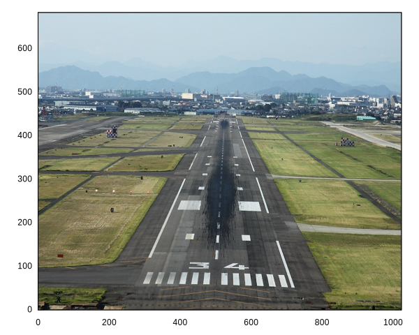

Note the dimensions are `[3 W H]` where 3 is the number of channels, `W`
is the width (x-extent), and `H` is the height (y-extent).

We can’t process the color channels in the image directly, so we need to
convert it to a single greyscale (luminance) channel. We can use
`rgbtogr` which uses a standard formula.

    my $grey = rgbtogr($runway)->double / 255;
    $gp->image($grey,
        { title => 'Greyscale image',
          clut  => 'grey' });
    $gp->fancy_display;

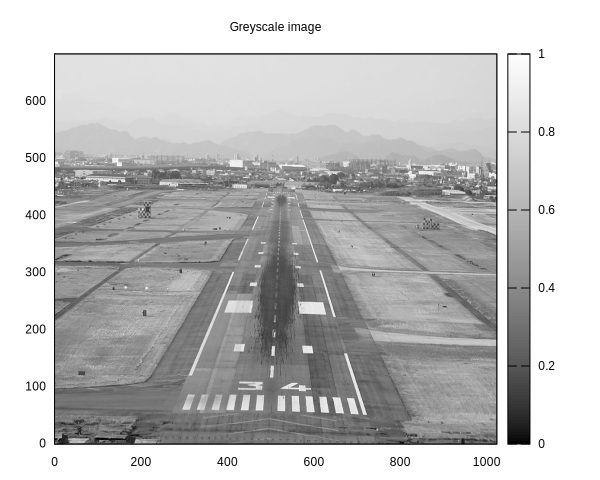

# Gaussian blur

We need to find edges in the image, but all real-world images have some
amount of noise (e.g., from random variation in brightness from pixel to
pixel). This noise can interfere with further processing such as edge
detection such that the noise may be picked up as spurious edges.

To smooth out this noise, we apply a 2D Gaussian filter to the image.
The filter:

1.  Looks at each pixel and its neighbors.
2.  Creates a weighted average where:
    - The center pixel counts most;
    - Nearby pixels count less;
    - Far pixels barely count at all;
    - The weights follow a bell curve (Gaussian) shape.

The parameter σ (sigma) controls how much smoothing we do:

- Small σ: less smoothing, keeps more detail.
- Large σ: more smoothing, might blur real edges.

The way we can perform this weighted average is by performing
convolution with the `conv2d()` function.

<b>Implementation note:</b> The 2D isotropic Gaussian is a separable
filter, which means that

can be written as the product of two 1D Gaussians:

This lets us compute 1D Gaussian values and use this to create the 2D
Gaussian values for the kernel, which is much more efficient than
computing the full 2D function directly (though the kernel is typically
small). It is also possible to use two consecutive `conv1d()` calls
here, but we’ll skip that for now.

Note that the above formulae are written without the normalisation
factor. Here we approximate the normalisation factor by dividing by the
sum.

See more at:

- R. Fisher, S. Perkins, A. Walker, and E. Wolfart, [Spatial Filters -
  Gaussian
  Smoothing](https://homepages.inf.ed.ac.uk/rbf/HIPR2/gsmooth.htm).
  “Hypermedia Image Processing Reference (HIPR)”, 2003.
- [Gaussian function -
  Wikipedia](https://en.wikipedia.org/wiki/Gaussian_function#Two-dimensional_Gaussian_function).

<!-- -->

    sub gaussian_kernel( $sigma = 1.0 ) {
        die 'sigma must be positive' unless $sigma > 0;

        my $GAUSSIAN_CUTOFF = 3; # Standard deviations from center (±3σ)

        # Kernel size: Ensure it's odd for symmetry around the center pixel
        # Total width = 2 * 3σ + 1.
        my $size = pdl(2 * ceil($GAUSSIAN_CUTOFF * $sigma) + 1)->sclr;

        # Create 1D Gaussian values centered at 0
        # using symmetric x-coordinates.
        my $x = xvals($size) - ($size-1)/2;
        my $gauss_1d = exp(-($x**2)/(2 * $sigma**2));

        # Create 2D kernel using outer product
        my $kernel = $gauss_1d->outer($gauss_1d);
        $kernel /= $kernel->sum; # normalise

        return $kernel;
    }

    sub gaussian_blur($img, $sigma = 1) {
        return conv2d($img, gaussian_kernel($sigma));
    }

## Test Gaussian blur on a point source

We can see how this works by testing on a simple “point source” image —
a single bright pixel surrounded by darkness:

    # Create a point source.
    my $point = zeroes(21,21);
    $point->set(10,10, 1);

    my $point_blurred = gaussian_blur($point, 1);
    $gp->image($point_blurred,
        { title => encode_utf8('Gaussian Blur of Point Source (σ=1)'),
          clut  => 'grey', },
    );
    $gp->fancy_display;

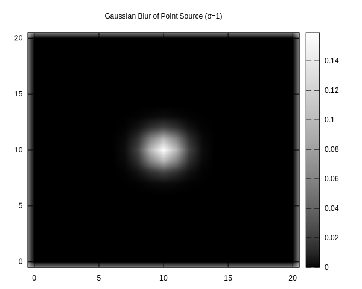

We can see this took the single point and “spread out” its intensity in
a radial manner. Furthermore, `$point_blurred` continues to sum up to 1
which means that brightness is preserved due to the normalisation
factor.

    say "Σ p = ", $point_blurred->sum->sclr;

    Σ p = 1

## Use Gaussian blur on image

We can now apply the Gaussian blur filter to the runway image.

    my $blurred = gaussian_blur($grey, 2);
    $gp->image($blurred,
        { title => encode_utf8('Gaussian Blur (σ=2)'),
          clut  => 'grey', },
    );
    $gp->fancy_display;

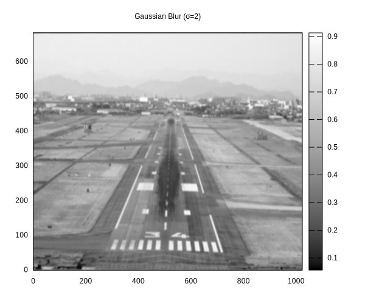

# Sobel edge detection

Now that we’ve smoothed out the noise, we can look for edges. But what
exactly is an edge in an image? An edge occurs where there’s a sharp
change in brightness — like the transition from the dark runway surface
to the bright markings.

Mathematically, these changes in brightness are derivatives: how quickly
is the brightness changing as we move across the image? The Sobel
operator helps us find these changes by looking at how brightness
differs between neighboring pixels in both horizontal (x) and vertical
(y) directions.

<b>Implementation note:</b> The Sobel operator uses two 3×3 kernels:

For horizontal changes (x-direction):

For vertical changes (y-direction):

We calculate both directions and combine them to get the total edge
strength:
<!-- $$\text{strength}^2 = (\text{horizontal change})^2 + (\text{vertical change})^2$$ -->

strength² = (horizontal change)² + (vertical change)²

The factor of ⅛ <!-- $\frac{1}{8}$ --> normalizes the kernels so the
maximum response to a perfect edge is 1.

Note: We store strength² directly rather than taking its square root
since:

1.  We only care about relative strengths.
2.  Avoiding the square root is more efficient.
3.  The threshold comparison will still work the same.

See more at:

- [Sobel operator -
  Wikipedia](https://en.wikipedia.org/wiki/Sobel_operator)
- [Edge detection -
  Wikipedia](https://en.wikipedia.org/wiki/Edge_detection)

We can threshold this strength to get a **binary edge image**: pixels
where the strength is above some threshold become 1 (edge), and others
become 0 (non-edge). The threshold is chosen relative to the average
edge strength in the image — this helps it adapt to different images
automatically.

<b>Note:</b> Often further post-processing of the edge detection result
is done such as thinning which can help create more clear edges without
spurious points, but we won’t do that here.

    sub sobel_operator($img) {
        # Define Sobel kernel and normalise it
        my $kx = pdl([
            [-1,  0,  1],
            [-2,  0,  2],
            [-1,  0,  1],
        ]);
        $kx /= $kx->abs->sum;

        # Stack x and y kernels
        my $k = cat($kx, $kx->transpose);

        # Add dummy dimension to image for conv2d
        my $img_3d = $img->dummy(-1);

        # Single convolution and magnitude calculation.
        # Returns strength² (no sqrt).
        return conv2d($img_3d, $k)->mv(-1,0)->pow(2)->sumover;
    }

    sub default_edge_threshold($strength2) {
        my $mean_strength2 = $strength2->avg;
        my $thresh2 = 4 * $mean_strength2;
        return $strength2 > $thresh2;
    }

    sub sobel_edges($img) {
        return default_edge_threshold(sobel_operator($img));
    }

## Test Sobel edge detection on point source

First, let’s see how edge detection works on our point source test
image. This is useful because:

1.  We know exactly what the input looks like (single bright pixel)
2.  The edges should appear where brightness changes most rapidly
3.  With a single point, we expect to see edges form a simple pattern

<!-- -->

    # Test sobel_edges on point source
    my $point_edges = sobel_edges($point);
    $gp->image($point_edges,
        { title => 'Sobel Edges of Point Source',
          clut  => 'grey', },
    );
    $gp->fancy_display;

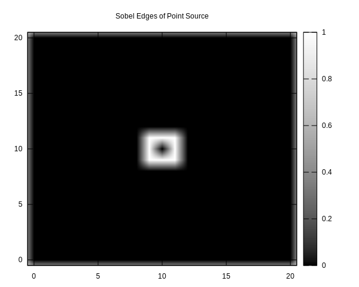

The result shows edges right next to the original point — this makes
sense because that’s where the brightness changes most sharply.

## Use Sobel edge detection on image

Now let’s apply edge detection directly to our blurred runway image:

    my $binary_edges = sobel_edges($blurred);
    $gp->image($binary_edges,
        { title => 'Sobel Edges Binarised',
          clut  => 'grey', },
    );
    $gp->fancy_display;

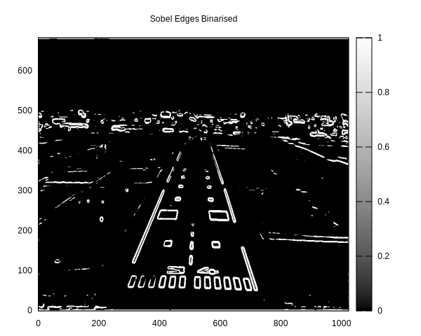

Looking at the result:

- Strong edges appear along the runway boundaries.
- The runway markings create clear edges.

These edge points are what we’ll use for line detection, but we still
have a challenge: how do we figure out which edge points belong to the
same straight line? We could try to trace along contiguous pixels, but
this can not deal with the less well-defined edges (e.g., broken
disconnected edges due to shadows).

That’s where the Hough transform comes in.

# Hough transform

As mentioned earlier, the Hough transform works by using points in the
image to “vote” for which line they are in. Well, technically, the Hough
transform is more general in that it can be used for any model to match
against as long as you have a valid parameterisation of the model in the
image space.

There are widely used parameterisations for lines and circles. We’ll be
using the line parameterisation because we are looking for lines.

## Define line parameterisation

What do we mean by parameterisation? It’s just a fancy way of saying
what variables do you need to define a shape. For example, a 2D line
segment needs four parameters
. Similarly,
a 2D line can be parameterised using a [slope-intercept
form](https://en.wikipedia.org/wiki/Linear_equation#Slope%E2%80%93intercept_form_or_Gradient-intercept_form)
 with the two
parameters  and
.

We’re looking for lines, so that could work, but it has issues when
dealing with vertical or nearly vertical lines. Our parameter range for
 would have to be very large in
those cases. An alternative parameterisation is [Hesse normal
form](https://en.wikipedia.org/wiki/Hesse_normal_form) which for a 2D
line follows the equation
 where given a target
line,  is the shortest
distance between that line and the origin and
 is the angle between the
axis and a line of length
 that intersects the
target line. Maybe that’s easier to see with a picture:

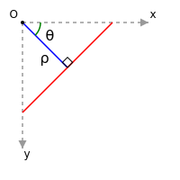

This diagram uses the top-left as the origin as is common with image
processing code. For a fixed θ, different values of ρ represent parallel
lines (note that ρ can be negative). Values of θ can range from -π/2 to
π/2 which allows for parametrising all possible lines including vertical
and horizontal lines.

We can implement an object to hold all this information in a single
place. By default, the parameter space is discretised to ~1 pixel
resolution in ρ and 1° resolution in θ.

    use MooX::Struct -retain, HoughParameters => [
        # Rho parameters
        rho_range => [ required => 1 ],
        num_rho   => [ required => 1 ],

        # Theta parameters
        theta_range => [ required => 1 ],
        num_theta   => [ required => 1 ],

        # Lazy builders for actual parameter values
        rho_res   => [ builder => '_build_rho_res' ],
        theta_res => [ builder => '_build_theta_res' ],
        rhos      => [ builder => '_build_rhos' ],
        thetas    => [ builder => '_build_thetas' ],
        _build_rho_res => sub {
            my $self = shift;
            my ($min, $max) = @{$self->rho_range};
            ($max - $min) / ($self->num_rho - 1);
        },
        _build_theta_res => sub {
            my $self = shift;
            my ($min, $max) = @{$self->theta_range};
            ($max - $min) / ($self->num_theta - 1);
        },
        _build_rhos => sub {
            my $self = shift;
            sequence($self->num_rho)->xlinvals(@{$self->rho_range});
        },
        _build_thetas => sub {
            my $self = shift;
            sequence($self->num_theta)->xlinvals(@{$self->theta_range});
        },

        # Class method for default parameters from image
        from_image => sub {
            my ($class, $img, %rest) = @_;
            my $max_rho = $img->shape->magnover;
            return $class->new(
                rho_range => [-$max_rho, $max_rho],
                num_rho => int(2 * $max_rho),  # ~1 pixel resolution
                theta_range => [-PI/2, PI/2],
                num_theta => 180,              # ~1 degree resolution
                %rest,
            );
        },
    ];

## Build the Hough space accumulator

The voting procedure works by varying θ and finding the ρ for a line
that a given edge point would be part of. These are then accumulated
into a 2D ndarray using `histogram2d()` which places the votes in the
appropriate bin for each parameter.

This accumulator is also known as the Hough space.

    sub line_hough($binary_edges, $params) {
        # Create accumulator array
        my $accumulator = zeroes($params->num_rho, $params->num_theta);

        # Find edge points and convert to 2D matrix of [x y] coordinates
        # shape [2,N].
        my $edge_points = whichND($binary_edges);

        say '[INFO] ', "Processing ", $edge_points->dim(1), " edge points";

        # Create transformation matrix [180,2]
        # for [x,y] coordinate order
        my $transform = cat(
            cos($params->thetas),  # for x
            sin($params->thetas),  # for y
        );

        # Calculate ρ = edge_points × transform giving [180,N]
        my $rho = $edge_points x $transform;

        # Scale rho values to accumulator indices using params values
        my $rho_min = $params->rho_range->[0];
        my $rho_max = $params->rho_range->[1];
        my $rho_scale = ($params->num_rho - 1) / ($rho_max - $rho_min);
        my $rho_idx = ($rho - $rho_min) * $rho_scale;

        # Create theta indices [180,N] where each row is 0..179
        my $theta_idx = zeros($params->num_theta, $rho_idx->dim(1));
        $theta_idx += sequence($params->num_theta);

        # Filter valid rho indices
        my $valid = ($rho_idx >= 0) & ($rho_idx < $params->num_rho);
        $rho_idx = $rho_idx->where($valid);
        $theta_idx = $theta_idx->where($valid);

        # Use histogram2d to accumulate votes
        $accumulator = histogram2d($rho_idx, $theta_idx,
                                   1, 0, $params->num_rho,
                                   1, 0, $params->num_theta);

        return $accumulator;
    }

## Find lines (peaks) in the Hough space

A maximum in the Hough space represents a line where many edge points
participate and those edge points are thus likely collinear. The
following looks for those peaks iteratively, but suppresses neighbouring
values (which represent nearby lines) so that they are not detected as
peaks in later iterations. The `range()` function is the perfect tool
for extracting out a neighbourhood and modifying it. However, be careful
that you use `sever()` so that you don’t accidentally end up zeroing out
the peak value!

    sub find_lines($accumulator, $params, $threshold_ratio=0.3, $nhood_size=[5,5], $max_peaks=20) {
        # Pre-allocate peaks array
        my $peak_indices = zeroes(2, $max_peaks);  # [rho_idx, theta_idx] × max_peaks
        my $peak_values = zeroes($max_peaks);
        my $num_peaks = 0;

        # Calculate deltas for neighbourhood
        my $rho_theta_delta = pdl(@$nhood_size);

        # Initialize working copy and get flattened view.
        my $H = $accumulator->copy;
        my $H_flat = $H->clump(-1);
        my $threshold = $H_flat->index(maximum_ind($H_flat)) * $threshold_ratio;

        while ($num_peaks < $max_peaks) {
            # Find peak location and value using maximum_ind
            my $max_ind = maximum_ind($H_flat);
            my $max_val = $H_flat->index($max_ind)->sever;

            last if $max_val < $threshold;

            my $peak_idx = pdl(one2nd($H, $max_ind));

            # Record peak
            $peak_indices->slice(":,$num_peaks") .= $peak_idx;
            $peak_values->index($num_peaks) .= $max_val;
            $num_peaks++;

            # Suppress neighbourhood using range.
            # Adjust center point back by half the neighbourhood size.
            my $corner = $peak_idx - $rho_theta_delta/2;
            my $r = $H->range($corner, $rho_theta_delta, 't');
            $r .= 0;
        }

        # Truncate results if fewer peaks found
        if ($num_peaks < $max_peaks) {
            $peak_indices = $peak_indices->slice(':,0:' . ($num_peaks-1));
            $peak_values = $peak_values->slice('0:' . ($num_peaks-1));
        }

        # Create parameter space values directly
        my $peak_params = cat(
            $params->rhos->index($peak_indices->using(0)),
            $params->thetas->index($peak_indices->using(1)),
        );

        return ($peak_params, $peak_values);
    }

## Extract lines from peaks

Then using these peaks, we transform back from the Hough space to the
binary edge image space in order to find the edge points that
participate in that line. These segments might be disconnected, so there
is some tolerance for that in the `$fillgap` parameter.

    sub extract_line_segments($edges, $peak_params, $fillgap=20, $minlength=40) {
        my ($width, $height) = $edges->dims;

        # Find all edge points in image as [2,N] array of [x,y] coordinates
        my $edge_points = whichND($edges);

        # Get parameters for each line from [N,2] array
        my $rhos = $peak_params->slice(':,(0)');
        my $thetas = $peak_params->slice(':,(1)');

        my @all_segments;
        my $delta_rho = 0.5;  # Half-pixel tolerance

        for my $i (0..$rhos->nelem-1) {
            my $rho = $rhos->at($i);
            my $theta = $thetas->at($i);

            # Project points onto normal direction (cos θ, sin θ) for [x,y] coordinates
            my $normal_proj = pdl([cos($theta), sin($theta)]);
            my $rho_all = inner($edge_points, $normal_proj);

            # Find points belonging to this line
            my $points_idx = which(abs($rho_all - $rho) <= $delta_rho);
            next unless $points_idx->nelem >= 2;

            # Get coordinates of line points, maintaining [2,N] structure
            my $points = $edge_points->slice([],$points_idx);

            # Calculate spans using minmaximum
            my $spans = pdl((minmaximum($points->xchg(-1,0)))[0,1])->xchg(0,-1)->diff2->squeeze;

            # Sort based on dominant direction
            my $sort_idx = $spans->at(0) > $spans->at(1)
                # More horizontal - sort by x, then y
                ? qsorti($points->slice('(0)') * $height + $points->slice('(1)'))
                # More vertical - sort by y, then x
                : qsorti($points->slice('(1)') * $width + $points->slice('(0)'));

            $points = $points->slice([],$sort_idx);

            # Find gaps using point-to-point distances
            my $diffs = $points->xchg(0,1)->diff2->xchg(0,1);
            my $gap_idx = which($diffs->magnover > $fillgap);

            # Create segment bounds - [2,N] array where dimension 0 is [start,end]
            my $seg_bounds = zeroes(2, $gap_idx->nelem + 1);

            # Handle segment bounds based on gaps
            if ($gap_idx->nelem) {
                $seg_bounds .= cat(
                    pdl(0)->append($gap_idx + 1),
                    $gap_idx->append($points->dim(1) - 1)
                )->transpose;
            } else {
                $seg_bounds .= pdl([0, $points->dim(1) - 1]);
            }

            # Process each segment
            for my $j (0..$seg_bounds->dim(1)-1) {
                my $endpoints = $points->slice([],$seg_bounds->slice(",($j)"));
                my $length = $endpoints->xchg(0,1)->diff2->xchg(0,1)->magnover->sclr;

                next unless $length >= $minlength;

                push @all_segments, {
                    point1 => $endpoints->slice(',(0)')->unpdl,
                    point2 => $endpoints->slice(',(1)')->unpdl,
                    rho   => $rho,
                    theta => $theta,
                    length => $length,
                    dominant_axis => $spans->at(0) > $spans->at(1) ? 'x' : 'y',
                };
            }
        }

        return \@all_segments;
    }

# Pipeline

Now let’s put this all together and take a look at what this looks like.

## Test pattern

First to ensure that various parts of this algorithm are working, let’s
go even simpler and create a synthetic test image that only contains
various lines which are guaranteed to be edges.

An easy way to do this is to create a vector image using SVG and then
render it to a raster image.

    sub create_test_pattern($width=400, $height=400) {
        # Create SVG object
        my $svg = SVG->new(
            width  => $width,
            height => $height,
        );

        # White background
        $svg->rectangle(
            x => 0,
            y => 0,
            width => $width,
            height => $height,
            fill => 'white'
        );

        # Create group for all lines with common style
        my $lines = $svg->group(
            style => {
                stroke => 'black',
                'stroke-width' => 2
            }
        );

        # Complete test lines
        $lines->line(x1 => 50,  y1 => 50,  x2 => 350, y2 => 50);   # Horizontal
        $lines->line(x1 => 350, y1 => 50,  x2 => 350, y2 => 350);  # Vertical
        $lines->line(x1 => 50,  y1 => 50,  x2 => 350, y2 => 350);  # 45 degrees

        # Standalone edges and partial segments
        $lines->line(x1 => 50,  y1 => 150, x2 => 150, y2 => 150);  # Broken horizontal 1
        $lines->line(x1 => 200, y1 => 150, x2 => 300, y2 => 150);  # Broken horizontal 2
        $lines->line(x1 => 250, y1 => 200, x2 => 300, y2 => 230);  # Short diagonal
        $lines->line(x1 => 280, y1 => 280, x2 => 320, y2 => 280);  # Isolated short

        # Merge test cases
        # Nearly parallel vertical lines
        $lines->line(x1 => 100, y1 => 200, x2 => 100, y2 => 350);
        $lines->line(x1 => 102, y1 => 200, x2 => 102, y2 => 350);

        # Slightly diverging lines
        $lines->line(x1 => 150, y1 => 200, x2 => 180, y2 => 350);
        $lines->line(x1 => 155, y1 => 200, x2 => 190, y2 => 350);

        # Closely spaced parallel horizontal segments
        $lines->line(x1 => 200, y1 => 200, x2 => 300, y2 => 200);
        $lines->line(x1 => 200, y1 => 203, x2 => 300, y2 => 203);

        # Nearly coincident short segments
        $lines->line(x1 => 250, y1 => 100, x2 => 300, y2 => 120);
        $lines->line(x1 => 251, y1 => 101, x2 => 301, y2 => 121);

        # Create temporary files using Path::Tiny
        my $svg_file = Path::Tiny->tempfile(SUFFIX => '.svg');
        my $png_file = Path::Tiny->tempfile(SUFFIX => '.png');

        # Save SVG
        $svg_file->spew_utf8($svg->xmlify);

        # Convert to PNG using full path strings
        system('convert', '-density', '150', $svg_file->absolute, $png_file->absolute) == 0
            or die "ImageMagick convert failed: $!";

        # Read PNG into PDL
        my $img = rpic("$png_file");

        # Binary (edge = 1, background = 0)
        my $binary = $img->double / 255 < 0.5;

        return $binary;
    }

This looks like:

    my $binary_test_image = create_test_pattern();
    $gp->image($binary_test_image,
        { title => 'Test pattern',
          clut  => 'grey', },
    );
    $gp->fancy_display;

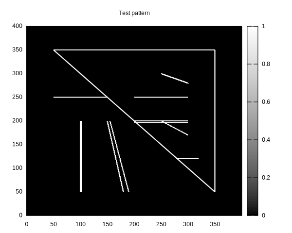

Now let’s visualise the various parts of this algorithm.

First, lets create a function that let’s us see what the Hough space
looks like and optionally where the peaks are.

    sub plot_hough_space($gp, $hough_space, $params, $peak_params=undef, $nhood_size=[15,15], $title='Hough Transform Space [ log(H + 1) ]') {
        my $log_H = log($hough_space + 1);

        # Base plot remains the same
        my @plot_items = (
            {
                title  => $title,
                ylabel => encode_utf8('ρ (pixels)'),  # rho
                xlabel => encode_utf8('θ (radians)'), # theta
                clut   => 'sepia',
                xtics  => {
                    labels => [
                        map { [ encode_utf8($_->[0]), $_->[1] ] }
                            ['-π/2' ,  -PI/2],
                            ['-π/4' ,  -PI/4],
                            [ '0'   ,    0  ],
                            [ 'π/4' ,   PI/4],
                            [ 'π/2' ,   PI/2],
                    ],
                },
            },
            with => 'image',
            $params->thetas->dummy(0, $params->num_rho),
            $params->rhos->dummy(1, $params->num_theta),
            $log_H,
        );

        # Add rectangles around peaks if provided
        if (defined $peak_params) {
            my $drho   = $params->rho_res   * $nhood_size->[0]/2;
            my $dtheta = $params->theta_res * $nhood_size->[1]/2;

            for my $i (0..$peak_params->dim(0)-1) {
                my $theta = $peak_params->slice("($i),1")->sclr;
                my $rho   = $peak_params->slice("($i),0")->sclr;

                my $rect = make_rectangle($theta, $rho, 2*$dtheta, 2*$drho);

                $rect->slice('(0)')->inplace->clip($params->theta_range->@*);
                $rect->slice('(1)')->inplace->clip($params->rho_range->@*);

                push @plot_items, (
                    { with => 'lines',
                      lc => 'rgb "#FFFFFF"',  # white lines
                      dt => '1',
                    },
                    $rect->using(0,1)
                );
            }
        }

        $gp->plot(@plot_items);
    }

    sub make_rectangle($x0, $y0, $width, $height) {
        # Create rectangle coordinates (5 points to close the box)
        return pdl([
            [$x0-$width/2, $y0-$height/2],
            [$x0+$width/2, $y0-$height/2],
            [$x0+$width/2, $y0+$height/2],
            [$x0-$width/2, $y0+$height/2],
            [$x0-$width/2, $y0-$height/2],  # close the rectangle
        ]);
    }

And we absolutely need to see the image with the detected lines
overlaid.

    sub plot_detected_lines($gp, $orig_img, $segments, $title='Line Detection Results') {
        $gp->plot(
            {
                title => $title,
                key => 'off',
            },
            { with => 'image' }, $orig_img,
            ( map {
                 (
                  { with => 'lines',
                    lc => 'rgb "#00FF00"',  # green color
                    dt => 1,                # solid
                    lw => 2, },             # thicker lines
                    pdl($_->{point1}[0], $_->{point2}[0]),  # x coordinates
                    pdl($_->{point1}[1], $_->{point2}[1]),  # y coordinates
                 )
             } @$segments ),
        );
    }

And a helper function to orchestrate the whole process of the Hough
transform, peak finding, and line segment extraction.

    sub visualise_hough_transform($gp, $orig_img, $binary_edges, $params, %opts) {
        my $max_rho = $params->rho_range->[1];

        my %defaults = (
            threshold_ratio => 0.3,
            nhood_size => [15,15],
            max_peaks => 20,
            fillgap => 50,
            minlength => int($max_rho * 0.2),  # 20% of max possible line length
        );
        %opts = (%defaults, %opts);

        # Run Hough transform
        my $hough_space = line_hough($binary_edges, $params);

        # Find peaks
        my ($peak_params, $peak_values) = find_lines($hough_space,
                $params,
                $opts{threshold_ratio},
                $opts{nhood_size},
                $opts{max_peaks});

        plot_hough_space($gp, $hough_space, $params, $peak_params, $opts{nhood_size});
        $gp->fancy_display;

        # Extract line segments
        my $segments = extract_line_segments($binary_edges, $peak_params,
            $opts{fillgap}, $opts{minlength});

        # Visualize detected segments
        plot_detected_lines($gp, $orig_img, $segments);
        $gp->fancy_display;

        return ($hough_space, $peak_params, $segments);
    }

## Hough line feature extraction visualised

    do {
        # For test pattern
        my $test_img = create_test_pattern();
        my $test_params = HoughParameters->from_image($test_img);
        my ($test_hough, $test_peaks, $test_segments)
            = visualise_hough_transform($gp, $test_img, $test_img, $test_params,
                nhood_size => [100,100],
                fillgap => 10,
              );
    };

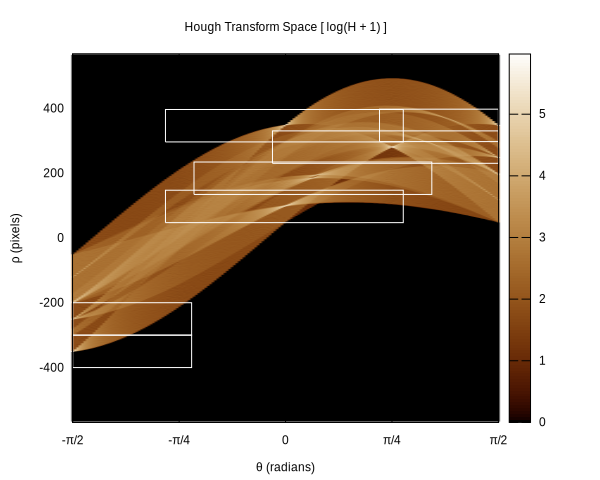

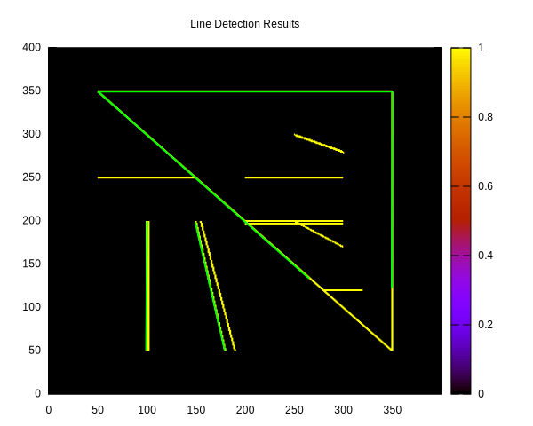

    [INFO] Processing 4446 edge points

Here we see that some of the lines in the test image that are nearby
each other are not considered a separate edge. This is a consequence of
multiple parts of the algorithm resolution, delta rho tolerance, and
neighbourhood suppression. Shorter lines are not picked up because the
minimum length parameter.

Vertical and horizontal line segments are found, but do not extend the
full length of the image elements.

------------------------------------------------------------------------

And finally for the runway image:

    do {
        # For runway image
        my $params = HoughParameters->from_image($binary_edges);
        my ($hough, $peaks, $segments)
            = visualise_hough_transform($gp, $runway, $binary_edges, $params,
                threshold_ratio => 0.1,
                nhood_size => [30,30],
                max_peaks => 50,
                fillgap => 20,
                minlength => 150,
              );
    };

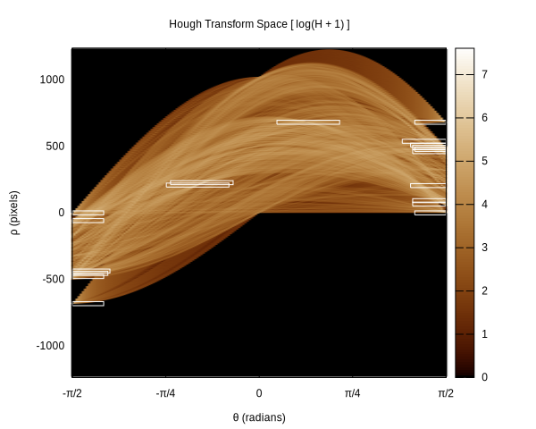

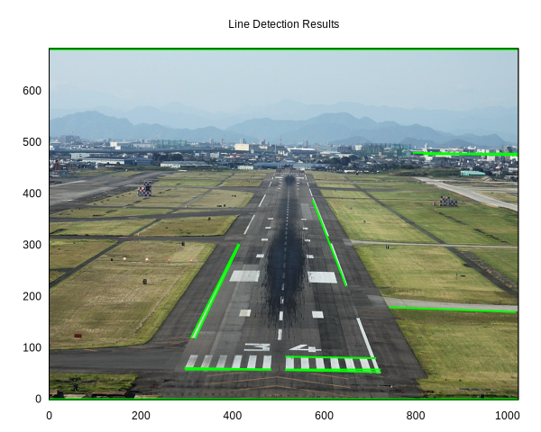

    [INFO] Processing 40034 edge points

Line segments in both a more vertical direction and a more horizontal
direction are found. There are some curious line segments that extend
the full length of the top and bottom of the image. These could be
filtered out using a region of interest (ROI) filter (i.e., essentially
a mask) as it is likely that edges near the border of the image do not
represent objects.

# What now?

With this, the elves were satisfied with their progress on the autoland
system…for now. But there are so many more things to explore. PDL let
them quickly process and visualise an algorithm, making it easy to
iterate on their design. For the next iteration they could swap out one
edge detection algorithm for another, come up with custom ways of
processing and post-processing the image, implement more robust line
segment extraction, or use a probabilistic approach to quickly extract
more complex objects ([especially those to
avoid](https://www.youtube.com/watch?v=MgIwLeASnkw)).
